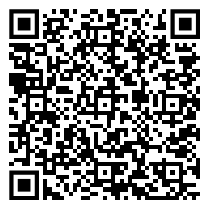

# Kolesarske: merjenje kakovosti kolesarskih površin

**Kolesarske** je projekt občanske znanosti, v katerem skupaj s prostovoljci merimo kakovost (gladkost oziroma hrapavost) kolesarskih površin s pomočjo pametnega telefona in kolesa.

Cilj projekta je zbrati **prostorske podatke o dejanskem stanju kolesarskih poti**, ki jih v uradnih evidencah pogosto ni ali pa ne odražajo izkušenj kolesarjev v praksi.

Projekt poteka v sklopu **magistrskega dela v nastajanju na Oddelku za geografijo Filozofske fakultete Univerze v Ljubljani**.

---

# O projektu

Kakovost kolesarskih površin pomembno vpliva na:
- udobje in varnost kolesarjev,
- izbiro poti,
- rabo kolesa kot vsakodnevnega prevoznega sredstva.

V Sloveniji (in širše) nimamo sistematičnih, prostorsko podrobnih podatkov o **dejanski gladkosti kolesarskih poti**. Uradne evidence večinoma beležijo obstoj infrastrukture, ne pa njene uporabniške kakovosti.

Projekt **Kolesarske** želi to vrzel zapolniti s pomočjo **participativnega (občanskega) zbiranja podatkov**. Kolesarji s pametnim telefonom med vožnjo beležijo vibracije, GPS lokacijo in druge osnovne podatke, iz katerih je mogoče oceniti kakovost podlage.

Zbrani podatki bodo uporabljeni:
- za analizo prostorskih vzorcev kakovosti kolesarskih poti,
- za razvoj metod merjenja s pametnimi telefoni,
- kot podlaga za magistrsko delo in nadaljnje raziskave.

---

# 

---

# Zakaj sodelovati?

S sodelovanjem v projektu:

- **prispevaš k boljšemu razumevanju stanja kolesarske infrastrukture**,  
- pomagaš razvijati **odprte, ponovljive metode merjenja**,  
- sodeluješ pri **akademskem raziskovalnem delu**,  
- zastopaš perspektivo dejanskega uporabnika kolesarskih poti.

Projekt temelji na predpostavki, da imajo kolesarji **najboljši vpogled v realno stanje poti**, saj jih uporabljajo vsak dan. Več kot bo sodelujočih, bolj zanesljivi in prostorsko raznoliki bodo rezultati.

Sodelovanje je prostovoljno, odprto in ne zahteva posebnega tehničnega znanja.

---

# Kako lahko sodelujem?

Sodelovanje je preprosto:
1. Na kolo namestiš telefon.
2. Med običajno vožnjo po kolesarskih poteh izvedeš meritev.
3. Po vožnji pošlješ podatke raziskovalni ekipi.

Meritev lahko izvedeš **kadar koli**, na **svoji običajni poti** (npr. v službo, šolo, na rekreacijo).

---

# Navodila za sodelovanje

Spodaj so natančna navodila za izvedbo meritev. Prosimo, da se jih čim bolj držiš – s tem zagotoviš primerljivost podatkov.

## Obvezna oprema

- Kolo **brez vzmetenja** ali z možnostjo **zaklepa vzmetenja** (sprednjega in/ali zadnjega).
- **Fiksno držalo za telefon** (kovinsko ali iz trde plastike; ne elastično).
- **Pametni telefon**:
  - Android ali iPhone.

---

## Predpriprava

- Na telefon namesti aplikacijo **phyphox**:  
  - [iOS](https://apps.apple.com/us/app/phyphox/id1127319693)  
  - [Android](https://play.google.com/store/apps/details?id=de.rwth_aachen.phyphox)  
  - [F-Droid](https://f-droid.org/packages/de.rwth_aachen.phyphox/)  
  - iOS 12.0 ali novejši, Android 4.0 ali novejši.

- Ob prvem zagonu aplikaciji dovoli dostop do vseh senzorjev.

- V aplikaciji phyphox:
  - klikni **+** → *Add experiment from QR code*,
  - skeniraj QR kodo,
  - izberi *Save to collection*.

S tem shraniš prednastavljen eksperiment **kolesarske_meritve**.

- Telefon namesti na krmilo kolesa, kot kaže slika. Držalo mora biti nameščeno **vodoravno**, torej vzporedno s tlemi.

  Za preverjanje vodoravnosti lahko uporabiš:
  - [iOS – Measure](https://apps.apple.com/us/app/measure/id1383426740)
  - [Android – Bubble level](https://play.google.com/store/apps/details?id=net.androgames.level)
  - [F-Droid – Bubble](https://f-droid.org/packages/org.woheller69.level/)

- Preveri tlak v obeh zračnicah:
  - tlak naj ustreza vrednostim, označenim na plaščih,
  - obe zračnici naj imata **enak tlak**.

---

## Potek meritve

- Če ima kolo vzmetenje, ga **zakleni**.
- Na telefonu:
  - izklopi varčevanje z baterijo,
  - vklopi lokacijo/GPS.

- Odpri phyphox, poišči eksperiment **kolesarske_meritve** in ga zaženi s klikom na puščico.
- **Ne zakleni zaslona** (lahko znižaš svetlost).
- Začni s kolesarjenjem.

Med meritvijo:
- kolesari predvsem po kolesarskih poteh,
- upoštevaj cestnoprometne predpise,
- bodi odgovoren in skrbi za svojo ter tujo varnost,
- občasno preveri, ali meritev še poteka (hitro, brez odvračanja pozornosti).

Če se med vožnjo začasno ustaviš (npr. semafor), **ni treba ustaviti meritve**.

Ko končaš s kolesarjenjem:
- ustavi eksperiment,
- izvozi podatke v obliki **CSV**,
- podatke pošlji po e-pošti na:  
  **kolesarske(at)gmail.com**

V sporočilo lahko dodaš:
- posebnosti poti,
- morebitne težave,
- druge komentarje, ki se ti zdijo pomembni.

---

# Viri slik

Slike in grafični materiali so avtorski ali uporabljeni z dovoljenjem in so namenjeni izključno predstavitvi projekta.
